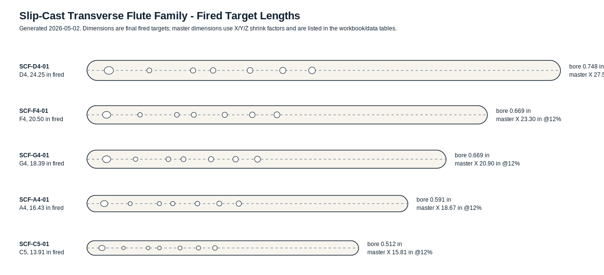

# Transverse Flute - Experimental Slip-Cast Ceramic Flute Lab

> *A preparatory design repository for a family of slip-cast ceramic transverse flutes - unvalidated, intentionally provisional, and ready to become the project accelerator once materials and shop time arrive.*


*First-pass fired target family for D4, F4, G4, A4, and C5. These are planning dimensions, not proven instrument dimensions.*

## What this is

Engineering documentation for an **experimental slip-cast ceramic transverse flute family**. The idea is to start with target final fired dimensions, scale the build masters for X/Y/Z ceramic shrinkage, cast and fire the first round, measure what actually happened, then use those measurements to correct the second round.

This repository is not a finished portfolio of validated instruments yet. It is creative preparatory space: an accelerator, launchpad, laboratory notebook, design-control folder, and build packet so the project can move fast once supplies are acquired.

The repository combines:

1. **A parametric design workbook** ([`Slip-Cast-Transverse-Flute-Family.xlsx`](Slip-Cast-Transverse-Flute-Family.xlsx)) with fired target dimensions, provisional master scaling, tone-hole schedules, a DoE matrix, measurement tables, and shrink-factor fitting sheets.
2. **A Round 1 design-of-experiments plan** ([`doe-plan.md`](doe-plan.md)) for comparing clay bodies, wall targets, bore profiles, embouchure geometry, and mold/drain orientation.
3. **Shop-facing build documentation**: [`design.md`](design.md), [`mold-workflow.md`](mold-workflow.md), [`assembly-manual.md`](assembly-manual.md), [`validation.csv`](validation.csv), [`bom.csv`](bom.csv), [`sourcing.csv`](sourcing.csv), and [`supplier-rfq.md`](supplier-rfq.md).
4. **Drawings and starter CAD** in [`drawings/`](drawings/), [`cad/`](cad/), and [`cnc/`](cnc/) so the first physical work can move from sketch to master/mold planning without starting from a blank page.

Sister project to [`flutes`](https://github.com/tonykoop/flutes), [`fujara`](https://github.com/tonykoop/fujara), [`didgeridoo`](https://github.com/tonykoop/didgeridoo), [`tongue-drum`](https://github.com/tonykoop/tongue-drum), and the broader instrument workshop documentation in this GitHub folder.

## Status and validation warning

**Status:** L2 V5 build-packet candidate

V5 explorer/build-packet candidate for review; fabrication authority
is limited to first-pass prototype planning tables and the local OpenSCAD body
starter. The packet is **not build-ready as a validated instrument** and is not
L3/L4 measured or runtime-verified.

This design has **not been physically built, tuned, fired, or validated**. The dimensions are first-pass engineering targets based on open-open flute math, ceramic shrinkage assumptions, and Tony's existing flute design-table habits.

Use every number in this repository as one of:

- `target` - what the fired instrument is intended to become,
- `assumption` - what Round 1 is testing,
- `starting point` - what will be corrected after measurement.

The design is ready for preparation, quoting, sourcing, CAD cleanup, mold planning, and experimental setup. It is not ready to be treated as a proven flute recipe.

## Background - why slip casting changes the flute problem

A transverse flute is an open-open air column excited by a player blowing across an embouchure edge. In a wooden or metal flute, the maker can usually machine the bore and holes directly to final dimensions, then tune by controlled cutting, undercutting, or keywork adjustments.

Slip-cast ceramic adds a different engineering loop:

- the model/master is not the final size,
- wet clay, bone-dry clay, bisque, and glaze-fired ceramic each move differently,
- X/Y/Z shrinkage may not be equal,
- long thin tubes can sag or ovalize,
- wall buildup changes tone-hole chimney height,
- glaze can damage acoustic edges if it enters the embouchure, bore, or holes.

That makes this project a natural fit for a measured iteration cycle. Round 1 is mostly about learning the clay/process correction factors. Round 2 is where the design becomes more serious.

## Governing acoustic model

First-pass model:

```text
f = c / (2 * L_eff)
L_acoustic = c / (2 * f)
end_correction_total ~= 0.6 * bore_ID
sounding_length ~= L_acoustic - end_correction_total
hole_distance_from_foot ~= L_acoustic * (fundamental_frequency / hole_frequency)
```

This is enough to create a rational starting family, not enough to declare success. Embouchure shape, hole chimney height, wall thickness, bore roundness, stopper position, undercutting, and ceramic surface quality will all move the real instrument.

## The first design family

| ID | Key | Role | Fired pre-trim length | Initial master X @ 12% shrink |
| --- | --- | --- | ---: | ---: |
| SCF-D4-01 | D4 | Low reference / long-body risk case | 24.247 in | 27.554 in |
| SCF-F4-01 | F4 | Family interpolation check | 20.505 in | 23.301 in |
| SCF-G4-01 | G4 | Middle reference / likely first practical prototype | 18.388 in | 20.895 in |
| SCF-A4-01 | A4 | Family interpolation check | 16.432 in | 18.673 in |
| SCF-C5-01 | C5 | Soprano / short-body response check | 13.911 in | 15.808 in |

The detailed target table is in [`data/fired-dimension-targets.csv`](data/fired-dimension-targets.csv). The first-pass hole schedule is in [`data/hole-schedule.csv`](data/hole-schedule.csv).

## Shrinkage model

Coordinate convention:

- X = flute length, bore axis, embouchure station, and tone-hole stations.
- Y = side-to-side bore/OD width and horizontal hole dimensions.
- Z = vertical bore/OD height, wall buildup direction, sag, and ovalization.

The workbook starts at a deliberately provisional 12% shrink in each axis:

```text
master_x = fired_target_x / (1 - shrink_x)
master_y = fired_target_y / (1 - shrink_y)
master_z = fired_target_z / (1 - shrink_z)
observed_shrink_axis = 1 - fired_measured_axis / master_measured_axis
round2_master_axis = round1_master_axis * fired_target_axis / fired_measured_axis
```

Those values are placeholders until fired test bars, bore rings, and flute bodies are measured.

## Round 1 DoE

Round 1 is a screening study, not a production batch. It varies:

- key/scale: D4, G4, and C5 screening with F4/A4 family fill-ins,
- clay body: cone 6 stoneware and cone 6 porcelain,
- wall target: thin, nominal, and thick drain conditions,
- bore profile: cylindrical and mild taper,
- embouchure geometry: standard oval and longer oval,
- mold/drain orientation: horizontal and vertical.

Primary responses:

- X/Y/Z shrink,
- bore roundness and wall thickness,
- crack/warp/sag/seam outcomes,
- fundamental and scale-note cents error,
- octave response and breath threshold,
- subjective playability and tonal stability.

The run matrix is in [`data/doe-build-matrix.csv`](data/doe-build-matrix.csv).

## Engineering challenges this repository is meant to capture

**1. Translating additive-manufacturing shrink intuition into ceramic slip casting.** The project deliberately separates target fired dimensions from master dimensions, then treats X/Y/Z shrink as measured process data rather than a fixed catalog value.

**2. Keeping the acoustic model honest.** Open-open flute math gives the starting geometry, but ceramic flute behavior will be corrected from measured prototypes. The validation sheets are as important as the design table.

**3. Designing for a fragile long body before the materials are on hand.** The D4 body is long enough that mold strategy, drying support, seam cleanup, and bore ovalization are major design concerns before a single note is played.

**4. Creating a repository that becomes useful the moment supplies arrive.** This repo is the setup work: BOM, sourcing, RFQ, shop sequence, drawings, CAD starter, DoE protocol, and measurement schema.

## How to use this repository

Start here:

- [`print-packet.html`](print-packet.html) - browser-friendly combined packet for reading or printing.
- [`Slip-Cast-Transverse-Flute-Family.xlsx`](Slip-Cast-Transverse-Flute-Family.xlsx) - the parametric workbook and measurement hub.
- [`design.md`](design.md) - the compact engineering brief.
- [`doe-plan.md`](doe-plan.md) - the experimental plan.
- [`mold-workflow.md`](mold-workflow.md) - the slip-casting control plan.
- [`assembly-manual.md`](assembly-manual.md) - shop sequence from master through final validation.

Then, once supplies are acquired:

1. Date-check suppliers and update [`sourcing.csv`](sourcing.csv).
2. Pick the first Round 1 run from [`data/doe-build-matrix.csv`](data/doe-build-matrix.csv).
3. Make and measure the master.
4. Cast shrink bars, bore rings, and the flute body together.
5. Record measurements in [`data/prototype-measurements.csv`](data/prototype-measurements.csv).
6. Fit Round 2 corrections in [`data/shrinkage-fit.csv`](data/shrinkage-fit.csv).

## Repository structure

```text
transverse-flute/
|-- README.md
|-- LICENSE                    <- CC-BY 4.0
|-- Slip-Cast-Transverse-Flute-Family.xlsx
|-- design.md
|-- doe-plan.md
|-- mold-workflow.md
|-- assembly-manual.md
|-- bom.csv
|-- sourcing.csv
|-- supplier-rfq.md
|-- validation.csv
|-- cut-list.csv
|-- print-packet.md / print-packet.html
|-- capstone-deck.md
|-- data/
|   |-- fired-dimension-targets.csv
|   |-- hole-schedule.csv
|   |-- doe-build-matrix.csv
|   |-- prototype-measurements.csv
|   `-- shrinkage-fit.csv
|-- drawings/
|   |-- family-overview.svg
|   |-- mold-stack.svg
|   `-- SCF-*-body.svg
|-- cad/
|   `-- slip_cast_transverse_flute_body.scad
|-- cnc/
|   `-- master-fabrication-plan.md
|-- evolution/
|   |-- master/manifest.json
|   |-- design-intent.md
|   `-- revisions.md      <- Stage 0 evolution-pipeline intake (Gate A not yet run)
`-- scripts/
    `-- generate_packet.py
```

## Status

| Section | Status |
| --- | --- |
| Repo description and CC-BY license | done |
| Parametric workbook | first-pass generated |
| Fired target dimension table | first-pass generated |
| Tone-hole schedule | first-pass generated |
| Round 1 DoE plan | drafted |
| Mold workflow | drafted |
| Shop assembly manual | drafted |
| CAD body starter | preliminary OpenSCAD concept |
| Manufacturing drawings | SVG review drawings only |
| V5 family spec | added; open-open / both-ends-open assumptions explicit |
| Visual authority register | added; generated/concept outputs are not fabrication authority |
| MCP provenance log | present; no live MCP sessions were run for this lane |
| Evolution-pipeline intake | Stage 0 intake added (manifest, design-intent, revisions); Gate A not yet run |
| Supplier pricing and availability | not checked |
| Physical prototypes | not started |
| Fired shrink validation | no data yet |
| Acoustic validation | no data yet |
| Round 2 correction factors | pending Round 1 |

## License

Released under [CC-BY 4.0](LICENSE) - use freely with attribution. The written documentation, generated design tables, drawings, scripts, and experimental framework in this repository are my own preparatory engineering work. Because the instrument design is unvalidated, reuse should preserve the experimental status and measurement assumptions until physical builds prove otherwise.
